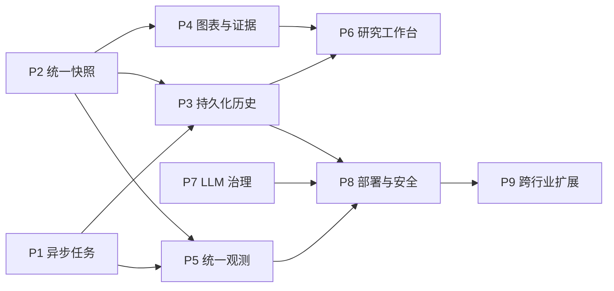

# 项目总纲

## 1. 总目标

本项目要交付一套符合 Harness Engineering 思路的通用 Agent 平台，并用证券金融分析验证它是否可靠、可复用、可恢复、可审计。

最终成果分为三层：

1. 通用平台：AgentHarness、完整 Agent Loop、Graph 引擎、记忆、Guardrail、工具接入和运行追踪。
2. 金融应用：真实金融数据、四类专业分析 Agent、综合辩论、交易建议、风险控制、回测和模拟运行。
3. 工程证据：自动化测试、Checkpoint、可观测性、Evaluator、熔断、最小权限、对比实验和完整文档。

项目不以“代码文件数量”或“周数到了”为完成标准。只有任务书的能力、运行入口、测试、报告和证据全部齐全，才算达到目标。

## 2. 文件职责和优先级

发生表述冲突时，按以下顺序解释：

1. 原始任务书定义最终交付范围。
2. `ROADMAP.md` 把任务书转成最终成果、验收条件和必要依赖。
3. `SPEC.md` 只描述当前正在处理的一个小功能。
4. `checklist.json` 记录正式任务、剩余缺口和验收证据。
5. `progress.txt` 保留历史工作记录，不代表当前正式完成度。

任务书要求与项目增强必须分开记录。增强能力可以提高质量，但不能代替任务书中的必做项。

## 3. “完成”的统一口径

周内里程碑完成，不等于任务书正式任务完成。

正式任务只有同时满足以下条件，才能标记为 `done`：

- 任务书列出的必需能力全部实现，没有用缩小后的原型替代原要求；
- 正常路径、拒绝路径和故障路径都有自动化测试；
- 有可直接运行的演示、报告或实验入口；
- 输入、输出、数据契约、安全边界和运行方式有文档说明；
- `checklist.json` 中列出可核查的代码、测试、报告和文档证据；
- 运行 README 中的验收命令成功；
- 对应交付包的整体验收条件已经满足。

只完成其中一部分时，正式任务保持 `in_progress`，成果写入 `completed_slices`，缺口继续保留在 `remaining`。

## 4. 当前真实基线

截至 2026-08-14，任务 1.1–1.4、2.1–2.2、3.1–3.3 和 4.1–4.3 的调整后范围均已完成。C3 已通过 Checkpoint 恢复和 20 只真实股票同批次端到端验收；D1 已通过历史时点门禁、完整市场约束和固定多股票真实行情实验；D2–D3 已通过可观测、独立评估、运行级熔断、最小权限和固定对比实验；D4 已完成本地模拟撮合、统一验收与时间豁免记录。产品化补强 P1–P4 也已完成，当前下一项是 P5 统一可观测性和可靠性面板。

| 正式任务 | 当前状态 | 已有成果 | 主要缺口 |
| --- | --- | --- | --- |
| 1.1 Harness 规范落地 | 已完成 | 九类项目组件的目录和职责、Git、清单、进度记录 | 阶段验收时继续检查九类组件是否有实际证据 |
| 1.2 Loop Engineering | 已完成 | 有限步与认知闭环、受控工具、三层记忆、Heartbeat/Cron、Hook、递归目标、独立工作目录、上下文注入和安全停止 | 无；真实模型属于 A4，非金融 Demo 属于 A5 |
| 1.3 Graph Engineering | 已完成 | YAML/JSON 工作流、边 Schema、并行波次、条件分支、重试、软超时、熔断、Checkpoint、Mermaid 和 LangGraph 映射 | 后续业务只需注册节点并提供工作流配置 |
| 1.4 Harness SDK | 已完成 | 统一 Harness、五类 Guardrail、配置注册表、自定义插件、分阶段 trace、测试和离线演示 | 后续 Agent 只需按各自 Schema、来源和交叉验证规则配置 |
| 2.1 数据基础设施 | 已完成 | 19 类统一 Data Hub、AKShare/Tushare 真实验证、只读 MCP、缓存/限流/重试/硬超时/统一错误和全真实样本离线回放 | 无；后续由 B2 Agent 消费统一数据接口 |
| 2.2 四类分析 Agent | 已完成 | 技术、基本面、行业、大盘/宏观四类 Agent 均已完成：确定性分析、评分、独立 Loop、Harness、测试、真实样本报告和 Graph 节点 | 无；后续交由交付包三编排综合研判和交易风控 |
| 3.1 综合研判与辩论 | 已完成 | 四 Agent 并行编排、2–3 轮证据辩论、Synthesis、Bull/Bear 目标边界、置信度、Consistency/Bias 和 Market Regime 门控 | 无；后续由 C2 消费研究结论并执行交易风控 |
| 3.2 Trader 与 Risk Manager | 已完成 | buy/sell/hold 候选、2% 单笔风险、30% 行业上限、15% 回撤、时段、Regime、流动性、止损止盈、人工确认和真实交易关闭 | 无；后续由 C3 编排完整 Graph |
| 3.3 完整金融 Graph | 已完成 | 单股票与批量入口、完整 C1→Trader→条件路由→Risk Manager→Finalize、Checkpoint 恢复、20 只真实股票报告/建议/审计记录 | 无；下一阶段由回测系统消费标准化建议 |
| 4.1 回测系统 | 已完成 | C3 历史时点证据门禁、下一开盘撮合、成本、停牌/涨跌停、分红送转、固定三股票组合、沪深 300 基准和夏普未达标分析 | 无；真实历史四 Agent 快照需长期积累，属于策略评估增强而非回测系统缺口 |
| 4.2 工业化 Harness | 已完成 | 统一可观测、独立 Evaluator、运行级熔断告警、9 Agent 最小权限、稳定 CLI、依赖锁、CI 和固定对比实验 | 无；真实模型线上对比可作为后续增强 |
| 4.3 模拟运行与最终交付 | 已完成（时间豁免） | C3→人工确认→本地模拟撮合、单文件可恢复账本、真实单日验证、运行/失败/确认/成交/复盘、完整文档包和统一主命令 | 无；原 1–2 周稳定性证明由用户在 2026-08-11 明确豁免，不宣称已达成 |

## 5. 实现原则

后文的四个交付包不是时间安排，只是为了避免遗漏最终成果。实现时遵循“平台底座→金融数据和专业 Agent→综合决策→回测与工程化”的依赖关系；互不依赖的工作可以并行，但不能为了赶进度跳过验收项。

- 先关闭平台缺口，再扩大金融应用。
- 先完成最小真实验证，再扩展外部 API 和数据类别。
- 确定性代码负责指标、风控和回测；LLM 负责规划、解释、辩论和候选方案。
- 每个阶段都保留离线模式，外部服务不可用时仍能运行测试和演示。
- 每次只实现一个可验收的小功能，但小功能完成后不得把整项正式任务提前标记为完成。
- 每个已完成切片都必须提供用户可直接运行、结果可直接阅读的中文验收入口；不能只把结果留在测试、内部对象或过程状态中。默认优先在终端展示，只有正式报告明确要求时才生成文件，避免产生大量临时产物。

## 6. 交付包一：通用 Agent 平台

### A1. Harness SDK（任务 1.4，已完成）

实现并接入五类 Guardrail：

- `JSONSchemaValidator`：验证 Agent 和 Graph 节点的结构化输入输出。
- `SourceAttributionFilter`：拒绝缺少 `source` 和 `timestamp` 的外部事实；金融数据继续额外要求 `as_of`。
- `RateLimiter`：限制指定时间窗口内的 API 调用次数。
- `KeywordBlocker`：阻断“绝对稳赚”“100% 收益”等违规或误导性表达。
- `CrossValidator`：使用独立的确定性代码重算并核对 Agent 结论。

五类规则都必须覆盖允许、拒绝、配置错误和 trace，并通过统一插件注册方式装配到 `AgentHarness`。

### A2. 补齐 Graph Engineering（任务 1.3，已完成）

- 使用 YAML/JSON 描述节点、边、条件、并行策略、重试、超时和熔断。
- 每条边显式声明边数据 Schema，状态传递前自动校验。
- 支持拓扑排序、并行调度、条件分支和跳过传播。
- 支持节点级重试、超时、熔断和 Checkpoint 恢复。
- 渲染 DAG 结构和节点运行状态，便于排查故障。
- 保留当前自研 Graph 引擎；补充与 LangGraph 的概念映射或最小兼容示例，说明两者边界，不用第三方框架掩盖自研实现。

### A3. 补齐 Loop Engineering（任务 1.2，已完成）

- 实现规划、行动、观察、反思和记忆五要素。
- 提供受控工具注册和调用，每次 Action 经过 Harness 前置检查，Observation 经过后置验证。
- 支持 Heartbeat/Cron 循环、Hook 事件触发循环和递归目标循环。
- 支持工作记忆、项目记忆和组织记忆，定义生命周期和持久化边界。
- 为并行任务提供独立工作目录或 worktree，避免状态冲突。
- 支持 Skill、项目约定和任务上下文注入。
- 保留最大步数、有限重试、失败纠偏和安全停止。

### A4. 接入真实模型运行层（已完成）

任务书技术栈包含 LLM API，因此平台必须增加统一 Model Gateway：

- 同一接口支持 Mock 模型和至少一种真实 LLM API。
- 支持结构化输出、超时、重试和错误归一化。
- 记录模型名称、token 消耗、耗时和调用结果。
- API 密钥只从本地环境变量读取，不进入仓库。
- 单元测试默认使用 Mock；真实模型只用于受控集成验证。

### A5. 证明平台具有通用性（已完成）

- Echo Agent 继续作为最小闭环测试。
- 增加一个小型非金融 Demo，例如多 Agent 资料研究或代码任务。
- 非金融 Demo 必须复用同一套 Harness、Loop、Graph 和工具接口，不能另写一套流程。
- 记录接入步骤，证明一个新领域能够在两天内完成最小接入。

### 交付包一验收条件

以下条件全部满足后，才能进入金融数据扩展：

- SPEC、Rule、Skill、Workflow、Scripts、MCP、SubAgent、dev-map 和任务看板九类组件都有实际运行或管理证据，不只是空目录。
- AgentHarness 支持五类 Guardrail 的插件化注册。
- 完整 Loop、三层记忆和三类调度方式可运行、可持久化。
- Graph 支持边 Schema、并行、条件边、重试、超时、熔断、Checkpoint 和可视化。
- Mock/真实模型共用统一接口，模型调用可追踪。
- Echo Agent 和非金融 Demo 均通过自动化测试和可运行演示。

2026-08-06 严格复核后补齐了 `dev-map.md`、Skill/MCP/SubAgent 可机读 catalog 和 Echo 独立演示。active catalog 条目的实现符号与 evidence 路径由项目测试自动核对；当时尚未实现的金融市场数据 MCP 继续归入 B1，不用其他 adapter 冒充完成。至此本交付包满足上述验收条件。

## 7. 交付包二：金融数据和四类分析 Agent

### B1. 金融数据 MCP（任务 2.1）

先用最小真实请求验证 AKShare 和 Tushare 的实际字段、时间、权限和异常，再逐类接入：

- 行情：日线、周线、分钟线、实时报价和资金流向。
- 财务：三大报表，以及 PE、PB、PS、ROE、资产负债率等指标。
- 宏观和行业：指数、板块、政策、利率和行业数据。
- 舆情：财经新闻、公告和研报摘要。

所有工具统一返回 `source`、`timestamp` 和 `as_of`。同时实现字段映射、缓存、限流、重试、超时、错误归一化和离线 fixture，确保外部接口失效时测试仍可复现。

### B2. 四类专业 Agent（任务 2.2）

每个 Agent 都必须拥有自己的 Loop，并由 Harness 包裹：

- 技术分析 Agent：MA、MACD、RSI、KDJ、布林带、支撑阻力和信号评分。
- 基本面 Agent：三大报表、估值分位、PE/PB/PS/ROE、资产负债率、DCF、安全边际和成长性。
- 行业分析 Agent：产业链、竞争格局、政策、景气度和龙头排序。
- 大盘/宏观 Agent：指数趋势、资金面、情绪、Market Regime 和风险偏好。

指标、估值和评分由确定性代码计算。LLM 可以选择工具、解释结果和反思，但不能编造数值。每个 Agent 都要有 JSON Schema、来源校验、代码交叉验证、单元测试和样例分析报告。

### 交付包二验收条件

- AKShare/Tushare MCP 覆盖任务书要求的数据类别，并有真实调用证据和离线回放。
- 四个 Specialist Agent 可以独立运行，也可以作为 Graph 节点运行。
- 每个 Agent 完成“规划→调工具→观察→反思→再规划”的闭环。
- 输出全部通过 Schema 和来源校验，技术和财务数值能够由代码重算。
- 交付四份 Harness 配置、完整测试和样例报告。

## 8. 交付包三：综合研判、交易建议与端到端 Graph

### C1. 综合研判与辩论（任务 3.1）

正式任务已完成。`CombinedAnalysisRuntime` 通过 Planner 在同一 Graph 并行运行四个 Specialist 并汇总报告、证据、来源和 Loop 轨迹；`StructuredDebateRuntime` 完成 2–3 轮 Claim → Evidence → Reasoning 辩论；`C1DecisionRuntime` 再统一完成 Synthesis、目标价研究区间、证据一致性置信度、Consistency Check、Bias Detector 和 Market Regime Gate。

- Planner 组织四类分析 Agent，能并行的分析并行执行。
- Bull Agent 给出看涨理由和目标价上限，Bear Agent 给出风险和目标价下限。
- 完成 2–3 轮结构化辩论，格式固定为 Claim → Evidence → Reasoning。
- Synthesis Agent 输出综合倾向、目标价区间和 0–100% 置信度。
- Market Regime 作为门控条件，熊市环境自动降低仓位上限。
- Harness 检查前后数据矛盾、无证据结论和只引用单边证据的偏差。

#### C1 后续增强：受约束的动态大模型辩论（项目增强，非任务书硬指标）

当前确定性辩论已经满足 C1 正式验收：句式和证据选择规则固定，报告中的评分、趋势、估值、行业表现和市场环境随输入数据变化。未来可以在不削弱当前可靠性的前提下增加动态大模型辩论：

- 通过现有 Model Gateway 分别生成 Bull/Bear 的候选 Claim 和 Reasoning，使论证角度与语言能够随证券、数据和市场环境变化。
- 强制模型输出 Claim → Evidence → Reasoning Schema；Evidence 只能引用四份 Specialist 报告中真实存在的路径，不能自行生成金融数值、来源或时间。
- 生成后由确定性代码重新检查 evidence path、value、source、timestamp、as_of、轮次回应和双方证据覆盖；校验失败时有限重试，超过上限则安全降级到当前固定模板。
- Synthesis、目标价区间、置信度、仓位门控和风控硬规则继续由确定性代码负责，LLM 只负责候选观点和自然语言解释。
- 为动态模式增加 Mock 离线测试、真实模型受控验证和固定评测集，对比证据有效率、观点多样性、正反平衡、重试率、耗时、token 成本和结果稳定性。
- 固定模板继续作为默认离线模式和故障降级路径；动态辩论是增强能力，不阻塞 C2、C3 和任务书硬指标的推进。

当前进度（2026-08-13）：代码与离线验收切片已完成。`DynamicDebateRuntime.run(...)` 已接入 Model Gateway、编号化证据目录、Claim/Evidence/Reasoning Schema、确定性证据还原、双方覆盖检查、虚构数字与违规措辞拦截、最多两次语义重试和固定模板降级；客户页面提供手动触发入口并展开两轮结果。`DynamicDebateEvaluationRuntime.run(dataset)` 新增固定 2/3 轮、共 4 次重复运行的模板/动态对照，统计候选与最终证据有效率、观点多样性、正反平衡、重试、降级、耗时、Token 和结果稳定性，并保留逐次原始结果。统一 CLI、后台 C1+ 卡片、Mock 故障恢复测试和可选 JSON 留存已完成。当前运行环境没有可读取的真实 Key，因此只剩使用用户自己的有效 DeepSeek Key 完成一次真实受控评测并留存结果；在此之前增强保持 `in_progress`，不影响已经完成的 C1 正式任务。

### C2. Trader 与 Risk Manager（任务 3.2）

正式任务已完成。`TraderRuntime` 校验完整 C1 输入并输出买入、卖出或持有的模拟候选；`RiskManagerRuntime` 再确定性执行全部风控硬规则；`C2TradingRuntime` 提供 Trader→Risk Manager 的统一入口。两层都通过 Schema 和结果重算 Harness，也都支持 Graph 节点。批准结果只允许后续模拟执行，`order_created` 和 `real_trading_allowed` 固定为 `false`。

- Trader 输出买入、卖出或持有的模拟信号、目标价区间和置信度。
- Risk Manager 使用确定性规则检查：单笔亏损不超过 2%、单行业不超过 30%、总回撤超过 15% 时强制减仓，以及交易时间、流动性、止损止盈。
- 交易前 Harness Pre-Flight 同时检查仓位、交易时间、Market Regime、流动性和回撤。
- 仓位超过 10% 必须进入人工确认流程。
- 所有结果都是研究和模拟建议，系统不直接执行真实交易。

### C3. 完整金融 Graph（任务 3.3）

正式任务已完成。`FinancialGraphRuntime.run(FinancialGraphQuery)` 是单股票统一入口，使用阶段 A 的自研 `GraphRunner` 编排完整 C1、Trader、Market Regime 条件路由、Risk Manager 和 Finalize。`FinancialBatchRuntime` 在该入口上隔离运行多个标的并汇总报告、建议和审计记录。C1 节点内部继续运行 Planner、四个 Specialist 并行 Graph、2–3 轮辩论、质量检查和 Synthesis，没有复制前序实现。

- 使用阶段 A 的自研引擎编排 Planner、四类分析 Agent、辩论、Synthesis、Trader 和 Risk Manager。
- 支持“大盘看空时跳过买入建议”等条件边。
- 任意节点失败后可以从 Checkpoint 恢复，不重复执行已经完成的节点。
- 对不少于 20 只股票跑通端到端流程，产出标准化投研报告、交易建议清单和 Harness 审计日志。

四项均已有可复现证据：恢复演示中 C1/Trader 各执行一次、失败的 Risk Manager 执行两次；20 只银行股真实批次请求 20、完成 20、失败 0，并返回 20 份报告、20 条建议和 20 份 Graph/Harness 审计记录。

### 交付包三验收条件

- 四路分析、辩论、综合、交易建议和风险校验组成一条可运行 Graph。
- 2–3 轮辩论格式、偏差检查和一致性检查有自动化测试。
- 风控数值、人工确认和真实交易关闭边界均由确定性代码强制执行。
- 不少于 20 只股票完成端到端运行，失败恢复和条件分支有可复现证据。

## 9. 交付包四：回测、工程化与最终交付

### D1. 回测系统（任务 4.1）

D1 已完成。`BacktestEngine.run(BacktestRequest)` 负责确定性单股票执行，`BacktestExperimentRunner.run(...)` 负责固定多股票实验。C3 快照必须证明证据的 `as_of` 和实际可得时间均不晚于决策时点；信号只能在生成后的下一可交易开盘成交。系统计入佣金、印花税和滑点，处理停牌、涨跌停方向权限、现金分红和送转股，并输出单股、组合及基准指标。固定实验使用三只银行股和沪深 300 各 243 根真实日线；夏普 `-0.8463` 未达到 `>0.5`，已如实记录且未用未来数据调参。

- 使用 Backtrader 或自研框架接收 Agent 输出信号。
- 明确信号时间和下一可执行时间，禁止使用未来数据。
- 计入佣金、印花税、滑点，并处理复权、停牌和涨跌停等交易约束。
- 输出夏普比率、最大回撤、胜率、盈亏比和滑点分析。
- 以夏普比率大于 0.5 作为任务书基线目标；未达到时如实报告并分析原因，不通过未来数据或反复过拟合来追指标。
- 固定股票池、时间区间、基准和参数，保留可复现实验配置。

### D2. Harness 工程化加固（任务 4.2）

- 可观测面板展示调用链、token 消耗、耗时和失败率。
- Evaluator 独立于被评估 Agent，使用固定数据集和评分规则量化质量。
- 连续失败 N 次后自动熔断、暂停并产生告警。
- 工具按最小权限开放，记录每个 Agent 的工具白名单。
- 增加稳定 CLI 或 API 入口、配置校验、依赖锁定和持续集成，保证主要流程可以重复运行。

完成状态：Harness、Graph 和 Model Gateway 已统一为可观测记录；独立 Evaluator 使用 4 个固定用例和确定性评分；运行级 Harness 连续失败 3 次后熔断、暂停并产生结构化告警；9 个当前 Agent 均有显式最小工具权限，五个工具型 Runtime 在注册和 dispatch 时强制复核；`D2EngineeringRuntime`、`agent-platform d2-verify`、锁定依赖和 CI 配置提供可重复入口。D2/T4.2 已完成。

### D3. 量化 Harness 的价值

使用同一批任务、数据和模型配置对比“有 Harness”和“无 Harness”：

- 幻觉率；
- 无效 API 调用数；
- 端到端成功率；
- 平均耗时和 token 成本；
- 故障恢复成功率。

实验必须保存原始结果、统计方法和结论，不能只写“效果更好”。

完成状态：固定离线工程实验使用同一 4 个任务、数据和脚本化模型首轮输出。无 Harness/有 Harness 的幻觉率为 80%/0%，无效工具调用为 1/0，端到端成功率为 25%/100%，平均耗时为 40ms/86.25ms，Token 为 80/120，有 Harness 组恢复成功率为 100%。该 fixture 证明项目规则链路行为，不冒充真实模型线上质量；方法、原始逐用例结果和边界由稳定 Runtime 返回，并可通过 `agent-platform d3-compare` 或 `Scripts/demo_harness_comparison.py` 独立查看。

### D4. 模拟运行和文档（任务 4.3）

- 对接券商模拟盘或本地模拟撮合，使用真实行情连续运行 1–2 周。
- 保存运行记录、失败记录、人工确认记录和复盘结论。
- 完成架构图、Graph Schema、Agent 卡片、数据字典、运行手册、回测报告、Harness 对比实验和复盘报告。
- 提供一条主命令或清晰的短流程，从环境检查开始复现主要结果。

完成状态：`PaperTradingRuntime` 只接受通过 C3 一致性校验且保持 `simulation_only=true`、`real_trading_allowed=false` 的报告；确定性代码按 100 股整手、佣金、卖出印花税和滑点计算模拟成交。单个版本化 JSON 账本集中保存 session、账户、运行、失败、人工确认、成交和每轮复盘摘要，并支持进程重启后继续追加。腾讯实时报价已完成真实单日验证。`FinalDeliveryRuntime.from_project().run()`、`agent-platform d4-verify` 和 `Scripts/demo_final_delivery.py` 从环境检查开始实际复现五条主链并核对完整文档包。原 1–2 周时间等待由用户于 2026-08-11 明确豁免，证据状态固定写为 `waived_not_proven`，不冒充长周期稳定性已经得到证明。D4/T4.3 按调整后范围完成。

### 交付包四验收条件

- 回测不存在已知未来函数，成本和执行时间语义明确，所有指标可复算。
- 任务书要求的可观测性、Evaluator、熔断和最小权限全部到位。
- Harness 对比实验给出真实数字和原始证据。
- 模拟运行完成工程验证和复盘；原周期等待若被项目所有者明确豁免，必须保留 `waived_not_proven`，不得写成已经达成。
- 文档、测试、配置和主要报告可由新环境复现。

## 10. 保留并强化现有项目优势

以下能力不是用来替代任务书要求，而是在整个项目中持续保留的质量标准：

- 金融数值使用 `Decimal`，避免二进制浮点误差污染价格和指标。
- 数据同时保留 `source`、`timestamp` 和 `as_of`，区分来源、获取时间和数据对应时间。
- 外部 API 与离线 fixture 使用同一数据契约，测试不依赖网络。
- Harness 在失败时保留原始异常、失败阶段和已经发生的 trace。
- Checkpoint 恢复不重复执行已经完成的节点。
- 回测区分信号时间和执行时间，并检查复权、停牌、涨跌停、费用和滑点。
- 指标、估值、仓位和风险阈值由确定性代码执行；LLM 不能覆盖硬规则。
- 真实交易默认关闭，密钥和本地 `.env` 不进入仓库。
- 每个功能都留下代码、测试、演示、文档和进度证据。

## 11. 最终验收结果

项目只有同时满足以下三项，才算完成任务书目标：

1. 通用平台：九类 Harness 组件、AgentHarness、完整 Loop、Graph、记忆、模型接口和非金融 Demo 全部可运行。
2. 金融应用：真实数据、四类 Agent、辩论、Trader、Risk Manager 和不少于 20 只股票的完整流程全部跑通。
3. 工程化：回测、可观测性、Evaluator、熔断、最小权限、Harness 对比实验、模拟运行和完整文档全部可复现。

完成后的项目是一套可运行、可验证的通用 Agent 平台原型，以及建立在该平台上的证券金融分析参考应用。它适合教学、实训、面试展示和继续产品化，但不宣称保证盈利，也不直接管理真实资金。

## 12. 正式任务完成基线

当前 A1–A5、B1–B2、C1–C3、D1–D4 的调整后交付范围全部完成。`verify-all` 负责命令行稳定复现；客户前台 `/` 负责展示 K 线、四维研究、综合结论和风险边界；团队后台 `/admin` 负责展示全部阶段、19 个操作入口、结果摘要和完整工程证据。DeepSeek 只承担解释层。受约束动态辩论的实现、固定评测集和离线统计已完成，真实模型结果仍需用户 Key 受控验收。原 1–2 周时间条件被明确豁免且保留未证明声明。第 13 节经项目所有者确认后成为新的产品化主线，但不回改正式任务完成状态。真实交易继续关闭。

已完成的展示强化切片：客户前台新增以 0 分为中轴的“四维研究天平”，直接显示四个 Agent 的方向、强度、主要支持、主要风险和分歧程度；原四维卡片继续解释原因。该图只投影 C3 已有确定性分数，不增加另一套分析逻辑，也不改变正式任务完成状态。

每次开始新功能前必须回答：

1. 它对应哪个正式任务或哪项项目增强？
2. 它补的是哪个明确缺口？
3. 本次结束后，正式任务是 `done` 还是仍为 `in_progress`？
4. 代码、测试、运行结果和文档证据分别在哪里？

答不清这四个问题，就不开始实现。

## 13. 产品化补强计划（待确认）

### 13.1 定位和状态

本节不改变 A1–D4 已完成的正式任务状态，也不把产品增强冒充任务书缺口。当前项目已经具备完整分析能力，接下来的重点从“继续增加 Agent 和指标”转向“让一次分析可以被创建、观察、保存、比较、解释和恢复”。

本节新增条目初始状态为 `planned`。只有项目所有者确认计划，并且对应条目的代码、测试、直观页面、运行入口和文档证据全部通过后，才能改为 `done`；已经通过这些条件的 P1–P4 现为 `done`。不按周数推进，严格按照依赖和实际价值排序。

### 13.2 产品化目标

补强后的目标形态是一套可长期使用的模块化单体应用：客户可以观察分析进度、查看部分结果和失败原因、重新打开历史报告、比较股票并下钻证据；开发和验收人员可以根据同一 `trace_id` 查看数据、Graph、模型和风险检查；应用可以在本机稳定运行，并为后续受控远程部署保留清晰 seam。

后端继续采用深 module：复杂任务编排、持久化、数据源降级和观测隐藏在少量稳定 interface 后面。当前阶段不为了“像成熟项目”而提前拆微服务；只有出现独立扩容、独立部署或团队所有权要求时，才考虑服务拆分。

客户前端采用“双层信息架构”：首次进入默认使用**普通版**，只回答“结论是什么、为什么、主要风险是什么、数据是什么时间”；用户主动切换到**专业版**后，才展开四 Agent 分数、技术指标、17 个真实节点、来源时间、评分规则和风控计算。两种模式必须读取同一份冻结报告和任务状态，切换模式不得重新取数、重新分析、再次调用模型或产生第二套结论。用户选择只影响展示复杂度，不改变确定性计算与交易安全边界。

专业版仍是面向研究用户的客户界面，不等于 `/admin` 团队验收后台。Graph、Harness、Checkpoint 文件、原始日志、配置和工程验收入口继续只放在后台；专业版只展示客户理解研究依据所需的指标、证据和可追溯信息。

### 13.3 确定的实施顺序

| ID | 状态 | 优化项 | 客户前端可见成果 | 后端 module 与稳定 interface | 完成验收条件 |
| --- | --- | --- | --- | --- | --- |
| P1 | `done` | 异步分析任务中心 | 后台提交立即返回任务编号；页面展示四 Specialist、C1、Trader、条件路由、Risk Manager、Finalize 和报告共 17 个真实节点；支持安全停止、失败节点续跑、刷新与服务重启恢复 | `AnalysisJobRuntime` 以 `submit/get/retry/cancel/result` 五个 interface 隐藏 Worker、容量、180 秒总超时、JSON 原子存储、启动恢复和错误归一化；Graph 事件 seam 与两层 Checkpoint 保留 Specialist/C3 已完成节点 | HTTP 202、结果门禁、逐节点状态、成功/失败/取消、条件分支、只重试未完成节点、超时迟到结果丢弃、JSON 报告恢复、启动自动续跑和桌面/移动页面全部通过 |
| P2 | `done` | 统一分析快照与数据源健康 | 报告显示“本次分析统一数据时点”、每类数据的新鲜度、缓存/真实状态和明确的降级说明；关键数据缺失时允许展示可信的部分结果 | 已新增不可变 `AnalysisSnapshot` 和 `AnalysisSnapshotRuntime.acquire(query)`；行情、四 Agent、K 线、DeepSeek 解释和报告消费同一快照；数据源策略统一处理主源、Tushare 日线备用源、Data Hub 新鲜缓存、最近可追溯缓存和 `not_available` | 14 类唯一请求先去重冻结，Graph 和图表不再重复抓日线；所有下游引用同一 `snapshot_id`；来源、`timestamp`、`as_of` 可追溯；主源、备用、缓存、部分缺失和关键全失效均有测试与终端演示，桌面/移动页面显示数据健康 |
| P3 | `done` | SQLite 持久化与历史报告 | 新增“最近分析”，可重新打开历史报告、查看当时数据版本和任务状态；服务重启后历史仍存在 | 定义 `AnalysisRepository` interface，提供 SQLite adapter 和内存测试 adapter；保存任务、快照、Agent 结果、Graph 状态、模型调用和报告版本；数据库迁移显式版本化 | 重启进程后可恢复任务和报告；不同报告不会互相覆盖；写入失败不产生半份结果；迁移、并发写入、损坏数据和恢复测试通过；敏感 Key 永不入库 |
| P4 | `done` | 普通版/专业版、专业图表和证据下钻 | 默认普通版把 17 个真实节点折叠为“准备数据→多维研究→风险检查→生成报告”，结果只突出通俗结论、主要理由、支持因素、风险因素、研究区间、数据时间和免责声明；专业版按需展开四 Agent、完整节点、技术指标、来源与评分规则，并提供十字线、OHLC/成交量提示、20/40/60 区间、日/周周期和指标开关 | 已增加只读 `ReportViewRuntime.project(report_id, view)`，`view` 只允许 `basic/professional`；module 从同一冻结报告和 P2 快照生成两种展示投影与证据索引，不让浏览器拼接业务事实，也不因切换模式重新运行 Graph、数据源或 LLM | 两种投影事实指纹一致；浏览器实测普通版边界、17 节点、四 Agent 证据、周 K、键盘 OHLCV、桌面与 390px 手机布局；切换前后历史报告数不变，专项测试和产品验收通过 |
| P5 | `planned` | 统一可观测性和可靠性面板 | 客户看到预计阶段、实际耗时和可操作错误；后台按一次分析查看瀑布链路、慢节点、数据源状态、缓存命中和模型成本 | 在 HTTP、任务、Data Hub、Graph、Harness、Model Gateway 和数据库间传播统一 `trace_id`；建立结构化日志、指标和 trace adapter；统计成功率、P50/P95、数据源失败率、缓存命中率、重试/降级率和 Token 成本 | 任一客户错误都能通过 `trace_id` 定位；日志不泄露 Key 和完整敏感输入；后台可以回答“慢在哪里、失败在哪里、是否降级”；离线故障注入能产生对应观测证据 |
| P6 | `planned` | 研究工作台与产品闭环 | 在 P4 双层展示基础上增加自选股、两股对比、同股前后报告变化、收藏、打印/导出；比较和历史页面继续服从当前普通版/专业版选择 | 在 P3 Repository 上增加 `ResearchWorkspaceRuntime`，统一管理自选、比较、收藏和导出；导出只读取已冻结报告，不重新调用数据源或模型；展示继续复用 P4 的 `ReportViewRuntime` | 用户可从分析→保存→比较→重新打开形成完整闭环；比较双方使用明确数据时点；普通版导出保持通俗，专业版导出包含来源和风险边界；无数据、部分数据和过期报告状态可读 |
| P7 | `planned` | LLM 治理与真实质量门禁 | 页面明确显示模型、是否降级、Token、解释版本，并允许对解释反馈“有帮助/没帮助”；模型不可用不影响确定性报告 | 为 Prompt、模型和 Schema 建立版本号；增加调用预算、结果缓存、模型路由、评测抽样和回滚；固定动态辩论评测成为 Prompt/模型变更门禁 | 使用真实 DeepSeek 完成受控固定评测并留存原始结果；Prompt 或模型升级未通过阈值不得成为默认版本；预算超限安全降级；LLM 仍不能修改指标、价格区间、仓位和风控 |
| P8 | `planned` | 正式部署、安全和质量门禁 | 用户通过稳定地址访问；客户入口和管理后台权限分离；页面具备明确版本、健康状态和维护提示 | 将本地 HTTP adapter 替换为正式 Web adapter，但复用现有业务 module；补充登录、角色权限、限流、模型预算、审计、密钥管理、Docker、健康/就绪检查；CI 增加 lint、类型、覆盖率、浏览器 E2E、Linux/Windows 和镜像构建 | 本地与容器一条命令启动；非 root 运行；普通客户不能访问 `/admin`；并发、请求大小、超时和费用有限制；依赖与密钥扫描通过；故障重启不丢失已提交任务 |
| P9 | `planned` | 证券主数据与跨行业扩展 | 股票搜索不再局限于 20 只银行股，可按行业筛选并明确哪些数据和能力可用 | 把硬编码证券目录迁移到版本化主数据；记录代码、交易所、名称、行业、上市状态、可用来源和快照；在 P1–P8 稳定后再扩展更多行业和资产 | 新证券不需要修改客户业务源码；行业映射不再统一写成“金融行业”；至少一个非银行行业完成真实端到端和行业匹配验收；未验证标的不能进入客户正式目录 |

### 13.4 依赖关系和优先级

执行优先级固定为：

1. **核心体验与数据一致性：P1 → P2 → P3。** 先解决长等待不可见、重复取数和结果无法恢复。
2. **客户产品能力：P4 → P5 → P6。** 先完成普通版/专业版的信息分层，再把已有工程证据转化成专业图表、证据下钻、历史和比较能力。
3. **模型与上线能力：P7 → P8。** 真实模型质量门禁明确后，再考虑多人远程访问与正式部署。
4. **业务范围扩展：P9。** 基础架构稳定后再扩展非银行股票，避免为每个新行业重复修补硬编码。

P1–P4 已完成。任务执行恢复继续使用轻量 JSON 与 Graph Checkpoint；P3 使用独立 SQLite Repository 长期保存成功报告、冻结快照、四 Agent、Graph 和模型调用元数据，并提供“最近分析”与历史重开；P4 用只读 `ReportViewRuntime` 将同一冻结报告投影为普通版和专业版。下一步进入 P5，补齐跨 HTTP、任务、数据、Graph、Harness、模型和数据库的统一 `trace_id`、结构化指标与可靠性面板。

### 13.5 暂不纳入的方向

- 不增加第五个金融 Agent，只为显得功能更多；只有出现独立、可验证的新职责时才新增。
- 不立即拆微服务、上 Kubernetes 或分布式消息队列；当前规模优先保持模块化单体。
- 不接入真实券商账户和真实下单；`simulation_only=true`、`order_created=false`、`real_trading_allowed=false` 继续作为硬边界。
- 不让 LLM 计算或覆盖指标、估值、价格区间、仓位和风控。
- 不为普通版和专业版分别运行一套分析；两种模式只能是同一冻结报告的不同展示投影。
- 不把工程验收后台直接塞进专业版；专业用户需要研究证据，不需要理解平台内部配置和运维日志。
- 不先扩展大量股票再补行业主数据；未完成匹配验证的标的不进入客户正式目录。
- 不把 Mock、单次成功或缓存命中写成线上稳定性证明。

### 13.6 每个产品化条目的统一验收模板

每个 P 项完成时必须同时回答并提供证据：

1. 客户在前端能直观看到什么新增行为？
2. 后端新增或深化了哪个 module，它的稳定 interface 是什么？
3. 正常、拒绝、超时、部分失败、恢复和安全路径分别如何验证？
4. 是否减少了重复请求、等待时间、错误率或维护复杂度，前后数字是多少？
5. 数据来源、时间、快照、`trace_id`、模型成本和交易安全边界是否仍可追溯？
6. README、专项文档、`checklist.json`、`progress.txt` 和一条直观验收入口是否同步？
7. 如果涉及普通版/专业版，两种模式是否引用同一 `report_id` 和 `snapshot_id`，并证明切换不会重新分析、调用模型或改变任何确定性结果？

缺少任何一项时，对应 P 项继续保持 `in_progress`，不得只凭页面截图或测试数量标记完成。
