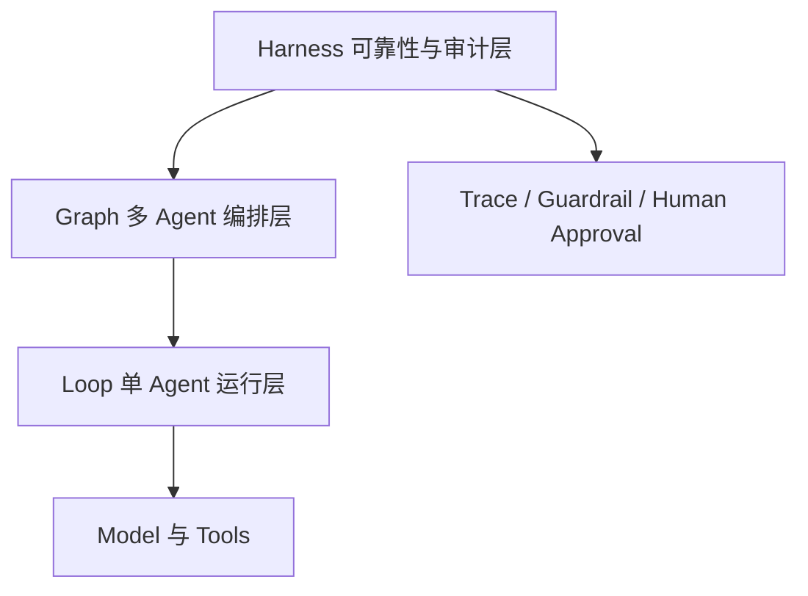

# 阶段一架构说明

## 运行关系



## 层级职责

- **Model 与 Tools**：提供模型推理和外部能力，不直接决定系统是否接受结果。
- **Loop**：负责一个 Agent 的计划、行动、观察、反思和记忆。
- **Graph**：负责多个 Agent 的节点关系、并行、条件分支和恢复。
- **Harness**：负责输入和输出校验、来源检查、限流、审计、熔断和人工确认。

## 第一周公共接口

```text
AgentRequest ──> Agent.run ──> AgentResponse
      │                              │
      └──── AgentHarness.run ─────────┘
                         │
                    HarnessResult
                  (response + trace)
```

第一周的 Harness 执行顺序固定为：

1. `preflight.started`：开始检查请求；
2. `preflight.passed`：请求和输入 Guardrail 通过；
3. `agent.started` / `agent.finished`：执行 Agent；
4. `postflight.passed`：输出和输出 Guardrail 通过。

任何一步失败都会记录对应的 `*.failed` 事件，并通过 `HarnessExecutionError` 暴露原始异常和已有 trace。

## 第二周 Loop

Loop 不直接调用 Agent，而是持有一个 `AgentHarness`。每次循环都创建带有当前步数和历史响应的请求：

```text
LoopState
   ↓ 生成本步 AgentRequest
AgentHarness.run()
   ↓ 返回 HarnessResult
completion_checker 判断是否完成
   ├── 是：LoopResult
   └── 否：更新 LoopState，进入下一步
```

Loop 的安全边界是 `max_steps` 和 `max_retries`。循环不会无限执行，失败重试耗尽后会保留失败状态和 trace。

### 认知 Loop 与受控工具

`CognitiveLoopRunner` 保留有限步和失败 trace，并把每步明确拆成 `Action → Observation → Reflection`。初始 `Plan`、全部动作、观察和反思都累计在不可变的 `CognitiveLoopState` 中。

```text
Plan
  ↓
Action ──> Harness 输入检查 ──> ToolRegistry ──> Tool
                                                ↓
Reflection <── Observation <── Harness 输出检查
   ├── continue
   ├── revise
   └── complete
```

`ToolRegistry` 是允许列表和唯一分发点。未知工具以及工具或 Guardrail 失败都会变成失败 Observation，让 Agent 有机会纠偏；只有通过后置检查的结果才是成功 Observation。`max_steps` 仍是硬停止边界，`max_tool_retries` 只允许对同一个 Action 做有限次重试。

`WorkingMemory` 在上述状态旁保存当前任务最近的认知摘要，并通过不可变 `WorkingMemoryView` 提供给 Agent。容量满时按 FIFO 淘汰；每次写入可通过统一 Store 接口保存版本化快照，当前提供内存和 JSON 两种适配器。完整认知历史仍保留在 `CognitiveLoopState`，工作记忆只负责有限的近期上下文。

项目记忆、组织记忆、调度、进程或 worktree 隔离和真实模型调用仍属于后续任务。

## 第三周 Graph/DAG

Graph 由一个入口节点、节点映射和有向边组成。运行前先做拓扑排序；如果入口不存在、边引用未知节点或图中有环，会在任何节点运行前拒绝执行。

```text
GraphDefinition
   ↓ 校验并生成拓扑顺序
GraphRunner 调度当前拓扑波次
   ↓ 节点返回字段更新并经过边 Schema
GraphState 确定性合并新状态
   ↓ 计算条件边
保存 JSON Checkpoint
```

每个节点只有四种状态：`pending`、`completed`、`skipped`、`failed`。条件边未激活的分支会标记为 `skipped`，并继续向后传播“不激活”信息，避免错误执行支路。

同一拓扑波次可以在线程池中并行运行，所有节点读取同一份状态快照；更新按照节点声明顺序合并，重复写入同一键会拒绝。节点策略包含有限重试、软超时和持久化熔断。

Checkpoint 保存图结构签名、共享状态、节点状态、执行顺序、尝试次数和熔断状态。恢复时会核对图结构，跳过已经完成或已经确定跳过的节点，只重新运行失败或尚未执行的节点。

YAML/JSON 工作流只通过 `NodeRegistry` 绑定允许的 Python 处理函数，每条边强制声明 source 输出和 target 输入 Schema。`GraphVisualizer` 可以把静态结构和运行状态渲染为 Mermaid。

## 当前实现边界

现在已经用确定性的 Echo Agent 验证了 Harness 和有限步 Loop，用离线计算 Agent 验证了认知 Loop、受控工具和有界工作记忆，并完成 Graph Engineering。Graph 当前采用单进程线程池，超时属于拒绝迟到结果的软超时，不强杀执行线程；可拖拽的图形化编辑器不在 A2 范围。认知 Loop 仍尚未包含项目/组织记忆、三类调度和真实模型。
