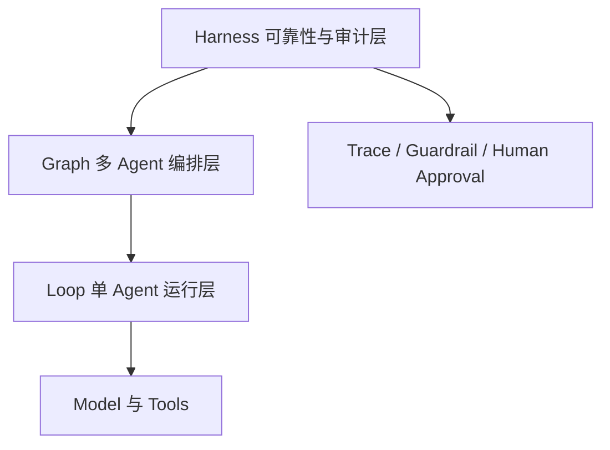

# 第 0 周架构说明

## 运行关系



## 层级职责

- **Model 与 Tools**：提供模型推理和外部能力，不直接决定系统是否接受结果。
- **Loop**：负责一个 Agent 的计划、行动、观察、反思和记忆。
- **Graph**：负责多个 Agent 的节点关系、并行、条件分支和恢复。
- **Harness**：负责输入和输出校验、来源检查、限流、审计、熔断和人工确认。

## 第一周公共接口

```text
AgentRequest ──> Agent.run ──> AgentResponse
      │                              │
      └──── AgentHarness.run ─────────┘
                         │
                    HarnessResult
                  (response + trace)
```

第一周的 Harness 执行顺序固定为：

1. `preflight.started`：开始检查请求；
2. `preflight.passed`：请求和输入 Guardrail 通过；
3. `agent.started` / `agent.finished`：执行 Agent；
4. `postflight.passed`：输出和输出 Guardrail 通过。

任何一步失败都会记录对应的 `*.failed` 事件，并通过 `HarnessExecutionError` 暴露原始异常和已有 trace。

## 第 0 周的实现边界

现在已经用确定性的 Echo Agent 验证了接口和 Harness 闭环。下一步先加入带最大步数的 Loop，再进入 Graph 和金融场景。
