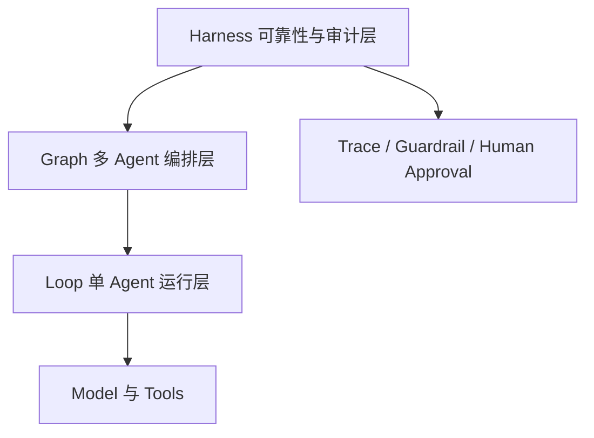

# 第 0 周架构说明

## 运行关系

## 层级职责

- **Model 与 Tools**：提供模型推理和外部能力，不直接决定系统是否接受结果。
- **Loop**：负责一个 Agent 的计划、行动、观察、反思和记忆。
- **Graph**：负责多个 Agent 的节点关系、并行、条件分支和恢复。
- **Harness**：负责输入和输出校验、来源检查、限流、审计、熔断和人工确认。

## 第 0 周的实现边界

现在只建立目录和约束，不提前实现这些运行层。后续先用确定性的 Echo Agent 验证接口，再逐层加入 Loop、Graph 和金融场景。
