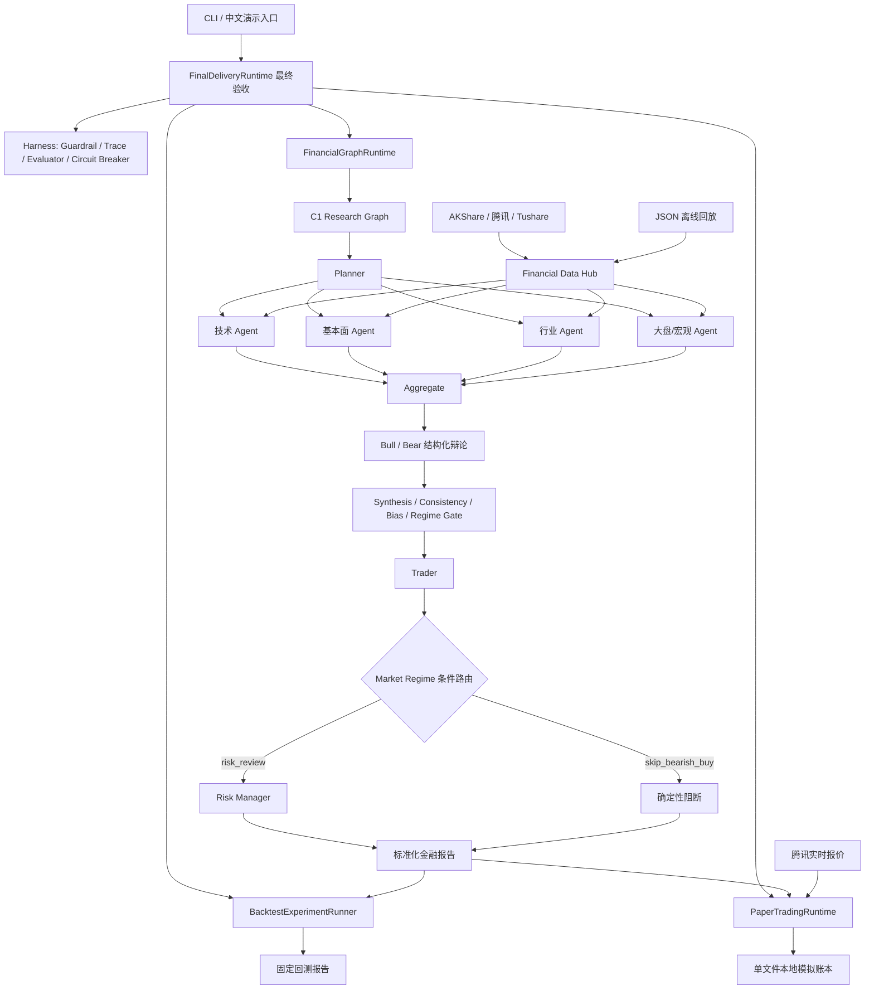

# 通用 Agent 平台及证券金融分析应用：最终交付说明

本文把分散在专项文档中的架构、Graph、Agent、数据、运行方式和实验结论汇总成一个最终交付视图。详细算法仍以对应源码和专项文档为准，不在这里复制实现。

最终验收采用 2026-08-11 调整后的范围：工程能力、真实数据最小验证、可复现流程和完整文档必须完成；原任务书的“连续运行 1–2 周”时间等待由用户明确豁免。当前只有单日真实运行证据，因此本项目不声称已经证明长周期稳定性。

## 1. 最终架构图



这套结构有四个关键分工：Data Hub 只负责可追溯数据；Agent 和 Graph 负责分析与编排；确定性代码负责指标、仓位、风控、撮合和回测；Harness 负责校验、审计、恢复与工程约束。LLM 只能解释或提出候选方案，不能覆盖数值规则或打开真实交易。

## 2. Graph Schema

### 顶层金融 Graph

| 节点 | 必需输入 | 主要输出 | 失败或分支语义 |
| --- | --- | --- | --- |
| `c1_research` | `c1_query`、`risk_context` | `c1_decision` | 四 Specialist 或质量校验失败则节点失败 |
| `trader` | `c1_decision` | `trader_candidate` | 候选动作由代码重算，不能直接创建订单 |
| `market_route` | `trader_candidate`、`risk_context` | `market_route`、`effective_risk_context` | 看空环境中的新买入走阻断分支 |
| `risk_manager` | 候选、研究报告、有效风控上下文 | `risk_review` | 检查仓位、亏损、行业、回撤、流动性、时段和人工确认 |
| `market_bearish_skip` | 条件路由结果 | `market_skip` | 输出 `blocked + hold`，跳过 Risk Manager |
| `finalize` | 路由选择及对应分支输出 | `financial_report` | 统一安全字段和最终决策来源 |

顶层执行顺序为：

```text
c1_research -> trader -> market_route
  -> risk_manager -> finalize
  或 market_bearish_skip -> finalize
```

### C1 内部 Specialist Graph

```text
planner -> technical ┐
        -> fundamental ├-> aggregate -> debate -> synthesis
        -> industry    │
        -> macro      ┘
```

四个 Specialist 处于同一拓扑波次，可以并行。Graph 边在状态传递前执行输入/输出 JSON Schema；Checkpoint 保存图签名、共享状态、节点状态、执行顺序、尝试次数和熔断状态。恢复时只重跑失败或未完成节点。

### 最终金融报告关键 Schema

| 字段 | 类型 | 说明 |
| --- | --- | --- |
| `status` | string | 必须为 `financial_graph_completed` |
| `symbol` | string | A 股统一代码，如 `sz000001` |
| `mode` | enum | `offline` 或 `live` |
| `research` | object | 四 Agent、辩论、Synthesis 和质量检查 |
| `trader` | object | 候选动作、研究价格区间和来源 |
| `route.selected_path` | enum | `risk_review` 或 `skip_bearish_buy` |
| `risk_manager` | object/null | 风控分支结果；看空阻断分支为 null |
| `final_decision` | object | 最终批准、调整、阻断或等待确认 |
| `decision_source` | enum | `risk_manager` 或 `market_route` |
| `simulation_only` | boolean | 必须为 true |
| `order_created` | boolean | C3 必须为 false |
| `real_trading_allowed` | boolean | 必须为 false |

## 3. Agent 卡片

下面列出当前九个正式登记的 Agent runtime。完整机器可读卡片位于 `SubAgents/catalog.json`。

| Agent | 职责 | 可用工具 | 模型权限 | 主要 Guardrail |
| --- | --- | --- | --- | --- |
| Echo | 最小 Harness 健康检查 | 无 | 无 | 请求/响应契约 |
| Research Planner | 非金融资料检索规划与反思 | `local_document_search` | 仅 Model Gateway | Action Schema、工具白名单、来源 |
| Research Reporter | 依据证据生成非金融报告 | 无 | 仅 Model Gateway | 报告 Schema、证据 ID 交叉验证 |
| Technical Agent | 获取行情并计算 MA、MACD、RSI、KDJ、BOLL 等 | `technical_market_analysis` | 无 | 来源校验、指标重算 |
| Fundamental Agent | 财报、估值、成长性和简化 DCF | `fundamental_analysis` | 无 | 来源校验、数值重算 |
| Industry Agent | 行业画像、政策、景气度、产业链和代表股 | `industry_analysis` | 无 | 来源校验、评分重算 |
| Macro Agent | 指数、资金、情绪、宏观和 Market Regime | `macro_analysis` | 无 | 来源校验、Regime 重算 |
| Trader | 把 C1 结论转成 buy/sell/hold 模拟候选 | 无 | 无 | 候选重算、禁止创建订单 |
| Risk Manager | 应用仓位和风险硬限制 | 无 | 无 | 风控重算、人工确认、真实交易关闭 |

Bull、Bear、Synthesis 和 Planner 还是金融 Graph 中的明确角色，但它们由 C1 深 module 统一实现和校验，不各自获得任意外部工具权限。

## 4. 数据字典

### 外部金融记录

| 字段 | 类型 | 语义 |
| --- | --- | --- |
| `dataset` | string | 19 类标准数据集之一 |
| `subject` | string | 股票、指数、行业或宏观指标标识 |
| `fields` | object | 数据集自己的业务字段 |
| `source` | string | 实际 provider，如 `tencent.qt.gtimg.cn` |
| `timestamp` | ISO datetime | 系统取得该记录的时间 |
| `as_of` | ISO datetime | 事实本身对应的时间 |
| `mode` | enum | `offline` 或 `live` |

`source`、`timestamp` 和 `as_of` 是外部事实的强制字段。`as_of` 用来判断历史时点是否可见，不能和获取时间混用。

### 行情 K 线

| 字段 | 类型 | 约束 |
| --- | --- | --- |
| `symbol` | string | 单个序列不能混合代码 |
| `open/high/low/close` | Decimal string | 有限正数且高低价关系合法 |
| `volume` | integer | 不小于 0；0 可表达停牌 |
| `as_of` | ISO datetime | 严格递增且不能重复 |

### 风控与模拟执行

| 字段 | 说明 |
| --- | --- |
| `approved_percent` | 通过全部风控后的目标仓位 |
| `estimated_single_trade_loss_percent` | 按止损距离估算的单笔亏损比例，上限 2% |
| `final_sector_exposure_percent` | 调仓后行业暴露，上限 30% |
| `current_drawdown_percent` | 当前组合回撤；超过 15% 触发降仓 |
| `human_confirmation_required` | 批准仓位超过门槛时必须确认 |
| `simulation_execution_allowed` | 只允许后续本地模拟撮合 |
| `order_sent_to_broker` | 永远为 false |

### 本地模拟账本

| 区块 | 内容 |
| --- | --- |
| `session` | session ID、股票范围、初始资金、计划区间、费用和安全字段 |
| `account` | 现金、持仓、平均成本、最近价格和已实现盈亏 |
| `cycles` | 每次 C3 摘要、实时报价、确认状态、模拟订单和安全边界 |
| `failures` | 错误类型、原因、恢复状态和恢复备注 |
| `confirmations` | 确认人、决定、备注和时间 |
| `reviews` | 运行数、成交数、失败数、真实日期覆盖和账户快照 |

## 5. 运行手册

### 环境准备

```powershell
cd C:\Users\梦\Desktop\通用agent
D:\Anaconda\python.exe -m pip install -e .
```

真实金融数据还需要安装 finance 可选依赖；DeepSeek、Tushare 等密钥只放用户环境变量或本地 `.env`，不得提交。

### 一条最终验收命令

仓库内直接运行：

```powershell
D:\Anaconda\python.exe Scripts\demo_final_delivery.py
```

安装项目后也可以运行：

```powershell
agent-platform d4-verify
```

总入口依次检查 Python、项目元数据、锁定依赖、离线 fixture、安全默认值和 Git 忽略规则，然后实际运行 Echo Harness、C3 完整金融 Graph、D1 固定回测、D2/D3 Harness 工程验收以及 D4 本地模拟执行。默认只汇总到终端，不生成临时报告文件。

### 完整自动化测试

```powershell
D:\Anaconda\python.exe -m unittest discover -s tests -v
```

### 真实行情模拟运行

```powershell
D:\Anaconda\python.exe Scripts\demo_paper_trading.py --live --confirm --session-id d4-live-20260810 --ledger .runtime\paper_trading\d4-live-20260810.json
```

只查看账本：

```powershell
D:\Anaconda\python.exe Scripts\demo_paper_trading.py --review-only --ledger .runtime\paper_trading\d4-live-20260810.json
```

`.runtime/` 被 Git 忽略。系统没有券商下单接口，`--confirm` 只确认本地模拟成交。

## 6. 回测报告

固定实验使用 2025-08-07 至 2026-08-07 的三只银行股与沪深 300 真实历史行情，每只股票和基准各 243 根日线。30 个滚动规则信号产生 11 次模拟成交。

| 指标 | 结果 |
| --- | ---: |
| 组合收益率 | -0.5408% |
| 最大回撤 | 0.7754% |
| 年化夏普 | -0.8463 |
| 沪深 300 收益率 | 14.0904% |
| 超额收益 | -14.6312% |
| 总成本 | 164.41 元 |
| 佣金 / 印花税 / 滑点 | 55.00 / 29.10 / 80.31 元 |

夏普没有达到任务书给出的 `> 0.5` 目标。项目保留这个负结果，没有使用未来数据或事后调参美化。该实验验证回测工程、时间门禁和市场规则，不证明策略盈利能力；滚动输入是 C3 合约格式的确定性回放，不冒充过去现场运行过的四 Agent 报告。

## 7. Harness 对比实验报告

固定 4 个任务在相同数据和脚本化模型首轮输出下进行有/无 Harness 对照：

| 指标 | 无 Harness | 有 Harness |
| --- | ---: | ---: |
| 幻觉率 | 80.00% | 0.00% |
| 无效工具/API 调用 | 1 | 0 |
| 端到端成功率 | 25.00% | 100.00% |
| 平均耗时 | 40.00ms | 86.25ms |
| Token 总成本 | 80 | 120 |
| 故障恢复成功率 | 无恢复样本 | 100.00% |

该实验保存了逐用例原始结果、评分方法和成本变化。它证明项目固定规则链路有效，也显示可靠性有耗时和 Token 成本；它不代表 DeepSeek 或 OpenAI 真实线上模型的普遍质量。

## 8. 模拟运行复盘

### 已验证结果

- 离线 C3 批准买入后，本地撮合完成 1300 股模拟成交，佣金 5.00 元、滑点成本 7.33 元；没有向券商发送订单。
- 未提供人工确认时，状态停在 `pending_human_confirmation`，不产生模拟成交。
- 篡改 C3 安全字段或使用未来报价时，运行在撮合前失败并写入失败记录。
- 真实最小验证通过腾讯 `market.realtime` 取得平安银行报价 11.2900，`as_of=2026-08-10T16:14:27+08:00`。
- 真实验证发生在收盘后，C3 按交易时段规则输出 hold，本地撮合记录 `no_action`，没有为了展示成交绕过风控。
- 本地 session `d4-live-20260810` 已记录 1 个真实行情日期、1 个 cycle、0 次失败、0 次成交和 100000.00 元现金。

### 时间要求处理

原任务书要求真实行情连续运行 1–2 周。截至最终交付时只积累了 1 个真实行情日期，不能证明一周以上的长期稳定性。2026-08-11 用户明确要求完成 D4 且不再考虑时间，因此最终验收把这项标记为 `waived_not_proven`：从调整后的项目范围看 D4 可以完成，但从原始长周期指标看该证明被豁免，而不是已经达成。

### 最终边界

- 能做：真实/离线金融数据分析、四 Agent 联合研究、结构化辩论、确定性交易候选与风控、模拟撮合、回测、审计和工程验收。
- 不能做：真实下单、管理真实资金、保证盈利、证明策略长期有效、证明已经连续稳定运行两周。
- 所有最终入口继续保持 `simulation_only=true`、`order_created=false`、`real_trading_allowed=false`。

在上述时间豁免和边界声明下，A1–A5、B1–B2、C1–C3、D1–D4 的调整后交付范围全部完成。
